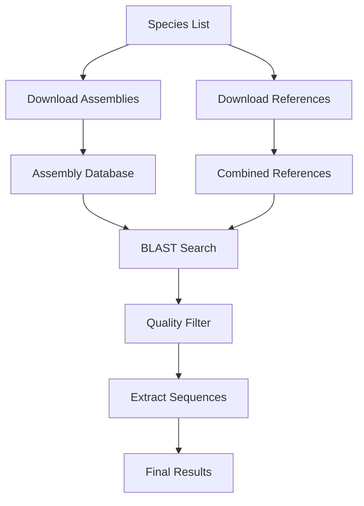

# BLAST Pipeline

A comprehensive pipeline for downloading genome assemblies, reference gene sequences, and extracting target genes for phylogenetic analysis. Specifically designed for circadian rhythm genes but can be adapted for any gene set.

## 🧬 Features

- **Automated Assembly Download**: Downloads genome assemblies from NCBI
- **Reference Gene Collection**: Gathers high-quality reference sequences
- **BLAST-based Gene Extraction**: Extracts target genes from assemblies
- **Quality Control**: Filters results based on identity and coverage
- **Comprehensive Logging**: Tracks all operations with detailed logs
- **Resume Capability**: Skips already processed files


## 📋 Prerequisites

### System Requirements
```bash
# BLAST+ tools
sudo apt-get install ncbi-blast+

# Samtools
sudo apt-get install samtools

# Seqtk
sudo apt-get install seqtk

# bc (for calculations)
sudo apt-get install bc
```

### Python Dependencies
```bash
pip install -r requirements.txt
```

## 🚀 Quick Start

### 1. Setup
```bash
# Clone or download the pipeline files
chmod +x *.sh
```

### 2. Prepare Species List
Create `species_list.tsv`:
```tsv
Homo	sapiens	human
Mus	musculus	mouse
Rattus	norvegicus	rat
Drosophila	melanogaster	fruit_fly
```

### 3. Run Complete Pipeline
```bash
./master_pipeline.sh --species species_list.tsv --email your@email.com
```

## 📁 File Structure

```
phylogenetic-pipeline/
├── get_gene_refs.py         # Download reference genes
├── download_assemblies.py   # Download genome assemblies  
├── extract_genes.sh         # Extract genes from assemblies
├── master_pipeline.sh       # Master pipeline script
├── requirements.txt         # Python dependencies
├── species_list.tsv         # Your species list
├── assemblies/              # Downloaded assemblies
├── references/              # Reference gene sequences
│   └── combined/            # Combined reference files
├── results/                 # Extracted gene sequences
│   ├── CLOCK/
│   ├── ARNTL/
│   └── ...
└── logs/                    # All log files
```

## 🔧 Individual Scripts Usage

### Download Genome Assemblies
```bash
python3 download_assemblies.py \
    --species species_list.tsv \
    --output ./assemblies \
    --email your@email.com \
    --assembly_level "Complete Genome" \
    --max_size 1000
```

### Download Reference Genes
```bash
python3 get_gene_refs.py \
    --species species_list.tsv \
    --output ./references \
    --email your@email.com \
    --min_length 100
```

### Extract Genes from Assemblies
```bash
./extract_genes.sh \
    references/combined/CLOCK_all_refs.fasta \
    ./assemblies \
    ./results/CLOCK \
    CLOCK
```

## ⚙️ Advanced Options

### Master Pipeline Options
```bash
./master_pipeline.sh \
    --species my_species.tsv \
    --email user@example.com \
    --skip-assemblies \          # Skip assembly download
    --skip-references \          # Skip reference download  
    --extract-only               # Only run extraction
```

### Assembly Download Options
```bash
python3 download_assemblies.py \
    --species species_list.tsv \
    --output ./assemblies \
    --email your@email.com \
    --assembly_level "Chromosome" \    # Assembly quality filter
    --max_size 500 \                   # Max size in MB
    --dry_run                          # Preview without downloading
```

### Reference Download Options
```bash
python3 get_gene_refs.py \
    --species species_list.tsv \
    --output ./references \
    --email your@email.com \
    --min_length 200 \                 # Minimum sequence length
    --dry_run                          # Preview without downloading
```

## 📊 Output Files

### Assembly Downloads
- `assemblies/Species_tag_accession.fasta` - Individual assemblies
- `assemblies/download_log.tsv` - Download log
- `assemblies/failed_downloads.tsv` - Failed downloads

### Reference Genes  
- `references/Species_GENE_accession_tag.fasta` - Individual references
- `references/combined/GENE_all_refs.fasta` - Combined references per gene
- `references/download_log.tsv` - Download log

### Extracted Genes
- `results/GENE/Taxon_GENE.fasta` - Individual extractions
- `results/GENE/all_GENE_extracted.fasta` - Combined results per gene
- `results/GENE/extraction_log.txt` - Extraction log

### Summary Reports
- `logs/pipeline_summary.txt` - Overall pipeline summary
- `logs/pipeline.log` - Master pipeline log

## 🔍 Quality Control

The pipeline includes several QC steps:

### Assembly Download
- Prioritizes RefSeq over GenBank
- Filters by assembly level (Complete Genome > Chromosome > Scaffold)
- Size limits to avoid huge files
- N50 quality scoring

### Gene Extraction  
- Minimum 70% identity threshold
- Minimum 70% query coverage
- Sequence length validation
- Automatic reverse complement handling

## 🐛 Troubleshooting

### Common Issues

**BLAST tools not found**
```bash
sudo apt-get install ncbi-blast+
# or for conda
conda install -c bioconda blast
```

**Python import errors**
```bash
pip install biopython requests
```

**No sequences extracted**
- Check reference quality
- Lower identity/coverage thresholds in extract_genes.sh
- Verify assembly quality

**NCBI API errors**
- Ensure valid email address
- Check internet connection
- Reduce request frequency (add delays)

### Log Files
Always check relevant log files:
- `logs/assembly_download.log`
- `logs/reference_download.log` 
- `logs/GENE_extraction.log`
- `logs/pipeline_summary.txt`

## 🎛️ Customization

### Adding New Genes
Edit `get_gene_refs.py`:
```python
GENES = ["CLOCK", "ARNTL", "PER1", "PER2", "YOUR_GENE"]
```

Edit `master_pipeline.sh`:
```bash
GENES=("CLOCK" "ARNTL" "PER1" "PER2" "YOUR_GENE")
```

### Adjusting Quality Thresholds
Edit `extract_genes.sh`:
```bash
identity_ok=$(echo "$pident >= 60" | bc -l)    # Lower from 70
coverage_ok=$(echo "$qcovs >= 50" | bc -l)     # Lower from 70
```

### Species File Format
Support for additional columns:
```tsv
Genus	species	tag	additional_info
Homo	sapiens	human	model_organism
```

## 📞 Support

For issues or questions:
1. Check the log files in `logs/` directory
2. Verify all dependencies are installed
3. Ensure NCBI email is valid and working
4. Check input file formats

## 🏗️ Pipeline Architecture



## 📄 License

This pipeline is provided as-is for research purposes. Please cite NCBI and the relevant databases, and tools used in this when using.

## 🤝 Contributing

Feel free to submit issues, feature requests, or improvements to make this pipeline more robust and user-friendly.
